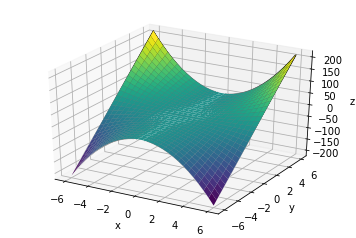

# Multivariable Functions

* Understand how multivariable function can be represented as a 3d graph
* Understand how, when we think of the error (cost) of a regression function it varies with changing slope and y-intercept values
* Understand how to think about the a regression line's cost curve in three dimensions

### Reviewing where we've been and why we're here

Before moving on, let's make sure we understand where we are.  We started this discussion by simply plotting our data.  Then we drew a regression line to estimate how a change in our input affected a change in our output.

Now, because our regression lines do not perfectly predict our data, we put a number to a regression line's accuracy by calculating the residual sum of squares (RSS).  And as we know, the size of the RSS is a function of our y-intercept and slope values, so we can plot our RSS as a function of one of these variables.

Because we want to approach our best fit line in an efficient manner, we look to the slope of our cost curve at the value of a y-intercept to tell us whether to increase or decrease our y-intercept variable and how large of a change to make.   We can make this change even without knowing what the rest of our cost function looks like, and just look to the slope at the current value.  This technique is called gradient descent.  To talk about how to calculate slopes of line, we got into a discussion of derivatives.  We learned how to think about them conceptually, as the instantaneous rate of change, as well as rules for calculating derivatives.

Now so far we have discussed gradient descent, just been in the context of changing a single variable of our regression formula $y = mx + b $.  And this has taken us from modeling a cost curve, to moving along that cost curve by a distance proportional to the slope, to calculating the slope.

### Going further

But in our regression line of $y = mx + b $ it is not just the y-intercept, $b$, we are changing to minimize our error, but the slope of the line, $m$, as well.  So our error is really a function of both variables, the y-intercept and the slope.

So now, thinking about our cost curve, it is really not a two dimensional curve that we are walking along, but a three dimensional one.  Three dimensions allows us to plot various values of $m$, $b$, and the cost associated with these values.

Let's spend some time looking at the above 3-d cost curve.  Unlike in the past, we don't just shift the y-intercept and while keeping the slope constant, but instead change both variables.  As we change our regression line's slope and y-intercept, the cost of the function changes.

### Thinking in multivariables

Before we talk about doing anything with a 3-d cost curve, let's just make sure we understand how to think about 3-d graphs and multivariable functions in general.  Then we can apply our knowledge to better understand a 3-d cost curve.

Ok, it's time to talk about multivariable functions dependent on two variables.  As you know, we express that a function is dependent on two variables with $f(x, y)$.  

So let's take a look at the function:

$$ f(x,y) = y* x^2 $$

This is what it looks like:

It takes a minute to see it, but this three dimensional graph of $f(x,y) = y*x^2$ makes sense.  Here's why.  Let's remember that the function $f(x) = x^2$ looks just like a smiley face.  Mathematicians call the smiley face a parabola.

Our parabola reflects our function squaring it's output for every input.  So for the function, $f(x) = x^2$, $f(2) = 4 $ and $f(3) = 9 $.

Our function $f(x, y) = y*x^2 $ means that this parabola is multiplied by the value of $y$.  So, for example, when $y = 2$,  $f(x, 2) = 2x^2 $ means the parabola is twice as steep as each output doubles.  And a negative $y$ in the function $f(x,y) = y*x^2$  flips our parabola upside down.  Take a second to consider what the graph looks like at different values of $y$.

Take a look one by one at the graphs below, which display what happens as we step through different values of $y$.  We see that the parabola is flipped for a negative $y$.  And the further $y$ moves away from zero the steeper the parabola.  

You can almost think of the graphs above as different freeze frames of our three dimensional function.  And we can view the three dimensional version as taking us from negative $y$ values to positive $y$ values, almost like having a movie take us through these frames in a cohesive viewing experience.

So now that we are reoriented, does it make more sense why the graph above maps to the function $f(x,y) = y*x^2$?  Do you start to see how and why the output of our function changes as the values of $y$ change?  And as the values of $x$ change?  Feel free to re-read this section to let it sink in.

### Moving back to our cost function

With a deeper understanding of 3-d graphs, let's return to thinking about our regression lines.  Our graph below displays how changing the $m$ and $b$ values of the regression line returns a different output of our cost function?

You may be able to see how changing our regression line below relates to a moving along our 3-d graph and a change in our cost function's output as displayed directly above.

If you feel comfortable with that, give yourself a pat on the back.

### Summary

In this section, we started thinking about the cost related to a dimension line not only as a y-intercept changes, but also as the slope changes.  To do this, we talked about multivariable functions in general, and how one can even think of of a three dimensional graphs in terms of successive two dimensional graphs.  This is how we can think of our cost curve, as matter of shifting one or both of the variables of our regression line, and seeing the resulting change to the function's accuracy.   
