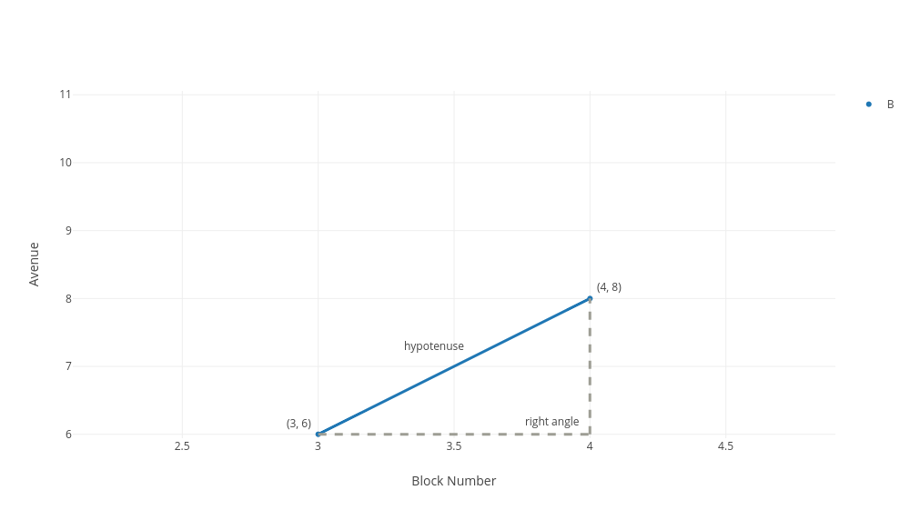

# Calculating distance

### Learning Objectives

* Understand how to use the Pythagorean theorem to calculate the distance between two points
* Become familiar with terminology like right angle, hypotenuse, and inverses

### Introduction

Previously, we used visualizations to see the closest customers to our salesperson, Bob.  Now using a simple graph works fine when Molly only has one salesperson.  However, as the business grows to have more salespeople, or when it becomes more difficult to just *see* who is closest, we need a more formalized approach.  So let's attempt to calculate the distance between Bob and a customer.

Once again, here are the locations of Bob and our customers:

| Name | Avenue #| Block # |
|------|------| ------     |
| Bob    | 4  |     8     |
| Suzie  | 1  |     11     |
| Fred   | 5  |     8     |
| Edgar  | 6  |     13     |
| Steven | 3  |     6     |
| Natalie| 5  |     4     |

And here are these locations in the form of a scatter plot.

Now, there are no labels in this particular plot, but we should be able to make sense of it anyway.  Our table says that Bob is located at avenue 4 and block 8, and when we look at where the x-axis reaches 4 and the y-axis reaches 8, we see a marker right there - that's Bob.

Now our next task is to calculate the distance between Bob, at $(4, 8)$ and a specific customer, the customer at $(3, 6)$.  In the general form, we can layout our problem by saying we want to calculate the distance between $(x_1, y_1)$ and $(x_2, y_2)$.  And for this example, we can assume that when calculating our distance that avenues and blocks are the same length, so we can just calculate our distance in terms of blocks.

> Those numbers at the bottom of $(x_1, y_1)$ and $(x_2, y_2)$ are used to say that we are referring to our first $x$ and $y$ values with one point, $(x_1, y_1)$ and our second $x$ and $y$ values of $(x_2, y_2)$.

### Calculating distance

Here's our first attempt at calculating distance.  To go from our first point of 8th street and 4th avenue to our second point of 6th street and 3rd avenue, we simply go two blocks down and one block to the left for a distance of three blocks.  Now that's a good start, but it's not how mathematicians would calculate distance between points.  Instead they would define distance to be the length of the shortest path between two points, and to achieve this, draw a diagonal straight line between the two points, and calculate the length of that line.  This is called Euclidean distance, and is what we will explain below.  This will be our approach:

1. Explain distance as the shortest path between two points - often a diagonal line
2. Form a right triangle around this diagonal line to make the diagonal part of a triangle  
3. Apply the Pythagorean theorem to calculate lengths of the sides of a right triangle, and thus the length of our diagonal line

Ok let's do it.

### Step 1: Defining Distance
The definition of distance is the length of shortest path between two points.  So imagine, if it helps, that Bob made his deliveries with the help of a drone.  So then what is the shortest path his drone could take from (4, 8) to (3,6)? We won't prove it, but one single straight line between any two points is the shortest path between them.  Here, the shortest path between (4,8) and (3, 6) is a straight diagonal line between them.  

That blue diagonal line between the two points is the shortest path between the two points, and therefore the distance between the two points.  Now we need to calculate the length of that line.

### Step 2: Forming a Right Triangle around the diagonal

Ok, to calculate that line, we imagine it forms the longest side of a **right triangle**.  With one side of the right triangle spanning horizontally from the lowest x-value to the highest x-value, 3 to 4, and another side spanning vertically from the lowest y-value to the highest y-value, 6 to 8.  Doing this above, you can see we have a nice triangle.

Formally, a right triangle is any triangle where one of the angles is 90 degrees -- also called the **right angle**.  But you can also just know that, if one of the sides is perfectly vertical and the other is perfectly horizontal, then we have a right triangle.  What's great about right triangles is that we have a good formula for calculating the length of each of the sides of a right triangle.  And once we calculate the longest side of the right triangle, we have our distance between the two points.  

### Step 3: Bring in Pythagoras

Ok, this is the formula for calculating the lengths of the sides of a right triangle, called the Pythagorean Theorem:

$$ a^2 + b^2 = c^2 $$

Let's break this formula down.  In the formula above, $a$ and $b$ are the shorter sides of right triangle -- called the **legs** -- and $c$ is the longest side of the right triangle -- the **hypotenuse **.  In the graph above, $a$ and $b$ would be the gray dotted lines.  And $c$ is the diagonal line, the hypotenuse.  Looking at the Pythagorean Theorem above, it says that the length of the first leg squared plus the length of the second leg squared equals the length of the hypotenuse squared.  

This is great because we already have what we need to calculate the length of our two legs, and with that we will have filled in the information needed to find the hypotenuse.  Take a look at the graph below.  We calculate the length of the horizontal side by subtracting our first x-value from our second x-value, then taking the absolute value.  We calculate the length of the vertical side by subtracting the first y-value from the second y-value then taking the absolute value.

> To take the absolute value of a number means to not consider whether a number is negative.  So the absolute value of -100 is 100, and the absolute value of -20 is 20.  We indicate the we are taking the absolute value of a number with the use of pipes.  So we can say $ \vert -20  \vert = 20$.

So in our formula of:

$$ a^2 + b^2 = c^2 $$ we have that:
$$a = (x_1 - x_2) = \mid 3 - 4 \mid = 1 $$
$$b = (y_1 - y_2) = \mid 8 - 6 \mid = 2 $$

$$ c^2 = a^2 + b^2 = 1^2 + 2^2 = 5 $$

$$ c^2 = 5 $$

So simply by plugging in data, we can see that five equals the length of the hypotenuse, squared.  And solving for our hypotenuse we have

$c = \sqrt{5}$

Writing $\sqrt{5}$ as a distance is perfectly fine.  However, if you would rather see this in decimal form, simply plug the $\sqrt{5}$ into a calculator (or type "sqrt 5" into Google's search bar) and you will get 2.23.  So that is the distance between our two points.  We have solved it!

> #### Squares, Square Roots, and Inverses
> **Squares** - Squaring something simply means multiplying something by itself.  So for example, 5 squared equals 5 $\times$ 5.  Four squared equals 4 $\times$ 4.  We denote four squared with the a raised number 2, as in $4^2$.  The two is the number of times we are multiplying four by itself.  

> **Square Roots** - Now we can go from a number's square back to the original square with the **square root**.  For example, the square of 4 is 4 $\times$ 4, which equals 16.  And the square root of 16 should undo the operation of squaring, so the square root of 16 equals four, and we denote the square root of 16 as $\sqrt{16}$.

> **Inverses ** - In mathematics, **the inverse** is anything that undoes the operation.  So the inverse of squaring is taking the square root.  The inverse of multiplying by ten is dividing by ten.  Here is a question:

> *What is the inverse of putting shoes on?*

> Well, just think of the definition - inverse means undoing the operation, and the undoing putting shoes on is taking shoes off.

### All together now

Now that we have seen how to solve for distance between two points in our example above, let's make sure we know how to do this in general.  We start with the formula:

$$ a^2 + b^2 = c^2 $$
and putting this formula in terms of our two points, $x$ and $y$, we have :
$$ (x_1 - x_2)^2 + (y_1 - y_2)^2 = c^2 $$

and solving for $c$ we have

$c = \sqrt{(x_{1} - x_{2})^2 + (y_{1} - y_{2})^2}$

where $c$ is the length of the hypotenuse, or the shortest distance between our two points.

So, that is the famous **Pythagorean Formula**, which says that in a right triangle, where $c$ is the length of the hypotenuse, and $a$ and $b$ are the other two sides.  So given two points, $(x_1, y_1)$ and $(x_2, y_2)$ we can plug them into our formula above to solve for the distance between them, $c$.

### Summary

Ok, that was a lot of math, but it was worth it.  We now know that to calculate the distance between any two points we can simply square the differences the between each point's $x$ and $y$ values, sum the squares, and then take the square root of the sum to calculate the distance between two points.

We can do this because a straight line is the shortest path between two points, also known as the distance between two points.  Because the Pythagorean Theorem gives us the formula $a^2$ + $b^2$ = $c^2$,  for calculating the length of a hypotenuse of any right triangle, we simply extend a horizontal line and a vertical line from the two points to form the remaining two sides of a right triangle.  Then we calculate the distance by knowing that the square of one side, $a^2$ is $(x_{1} - x_{2})^2$ or the x coordinate of one point minus the x coordinate of the other point squared, and the square of the length of the other side, that is $b^2$, is $(y_{1} - y_{2})^2$, the y coordinate of one point minus the y coordinate of the other point squared.  So this gives us $(x_{1} - x_{2})^2$ + $(y_{1} - y_{2})^2$ = $c^2$ or, solving for c, $c = \sqrt{(x_{1} - x_{2})^2 + (y_{1} - y_{2})^2}$.
